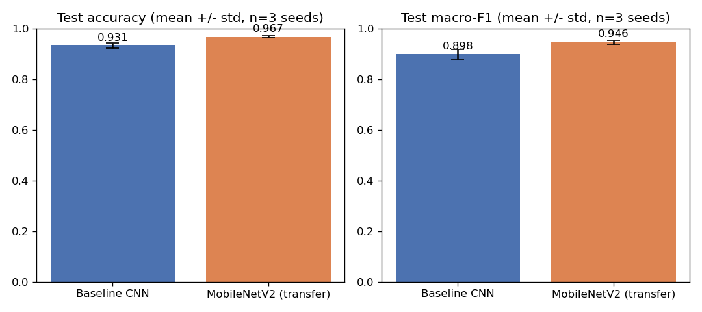
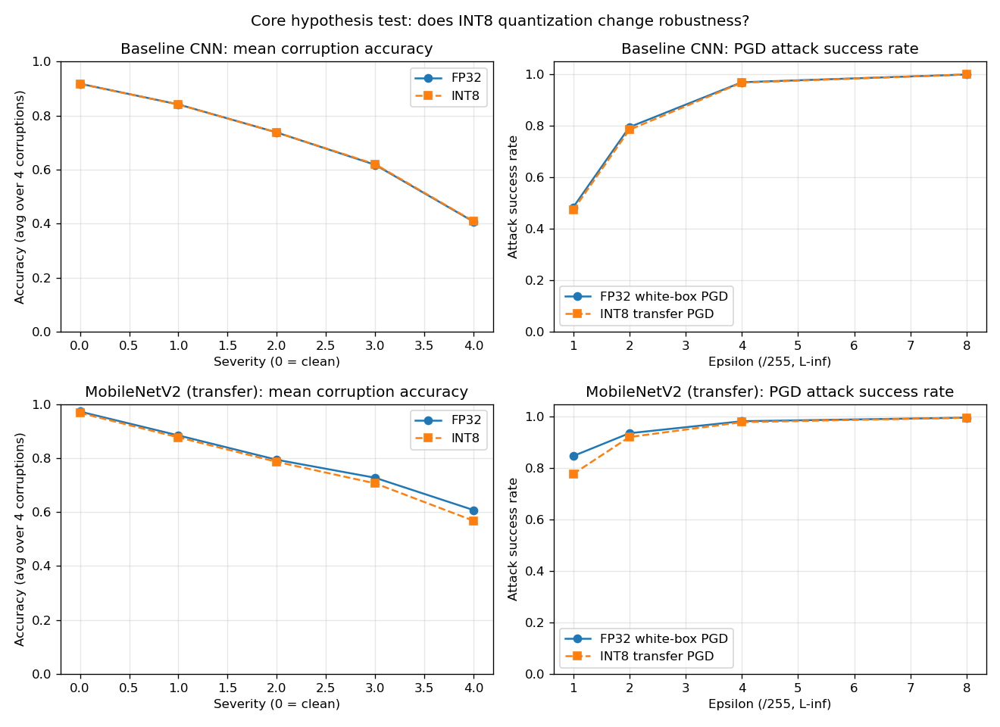
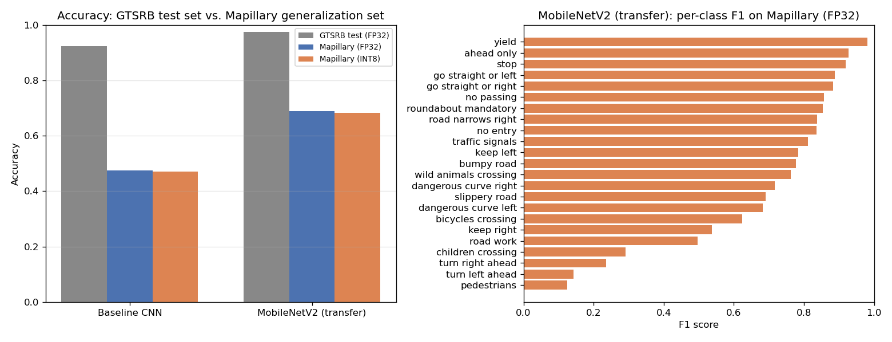
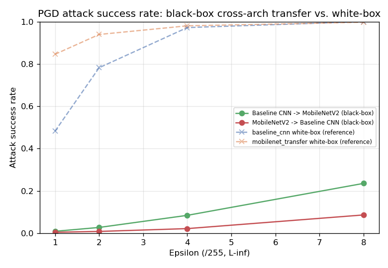

# Quantization vs. Robustness: Evaluating INT8 Traffic Sign Recognition Under Corruption, Adversarial Attacks, and Distribution Shift

Does INT8 quantization for real-time deployment compromise a traffic-sign classifier's
robustness to visual corruptions and adversarial attacks — even when clean accuracy is
preserved?

**[Live metrics dashboard](https://charith-reddy-pareddy.github.io/Robustness-and-Quantized-Inference-for-Autonomous-Traffic-Sign-Analytics/)** &middot;
full write-up, methodology, and results: [reports/ROBUSTNESS_REPORT.md](reports/ROBUSTNESS_REPORT.md)

> **Key finding:** INT8 cut model size ~3.4x and latency ~2x with clean accuracy preserved
> (≤0.6pp drop). Adversarial examples transferred from FP32 to INT8 no more effectively
> than white-box attacks against FP32 itself — but a genuine black-box attack (crafted
> against the *other* architecture entirely) succeeds far less often than that same-model
> transfer does, showing the FP32→INT8 transfer numbers mostly reflect two nearly-identical
> decision boundaries, not intrinsic INT8 robustness. Corruption robustness held for the
> baseline CNN but degraded for MobileNetV2 at high severity (up to -9pp). Both models also
> generalize far worse than their GTSRB numbers suggest on a different dataset
> (Mapillary+DFG) — but the FP32-vs-INT8 gap stays just as small there as on GTSRB.

| Architecture comparison (FP32, 5 seeds) | Corruption + adversarial, FP32 vs. INT8 |
|---|---|
|  |  |

| Out-of-distribution generalization (Mapillary+DFG) | Black-box cross-architecture transfer |
|---|---|
|  |  |

See [Threat models](reports/ROBUSTNESS_REPORT.md#threat-models) in the full report for
exactly what the adversarial claim does and doesn't establish. A multi-seed statistical
pass (confidence intervals, bootstrap CIs, and significance tests on the FP32-vs-INT8
deltas above) is in progress — see `PLAN.md`.

## Methodology summary

- **Dataset**: GTSRB (43 classes), track-aware train/val split (GTSRB frames are
  sequential dashcam video of the same physical sign — a naive random split leaks
  near-duplicates across the split).
- **Architectures**: a from-scratch CNN and a fine-tuned MobileNetV2, each trained across
  5 seeds.
- **Robustness axes**: 4 corruption types x 4 severities; FGSM/PGD adversarial attacks
  across 4 epsilons; out-of-distribution generalization to a second dataset.
- **Quantization**: static INT8 via ONNX Runtime, evaluated against FP32 on every axis
  above.
- Full dataset/methodology detail: [reports/ROBUSTNESS_REPORT.md](reports/ROBUSTNESS_REPORT.md#dataset-and-methodology).

## Experiment matrix

| Dimension | Baseline CNN FP32 | Baseline CNN INT8 | MobileNetV2 FP32 | MobileNetV2 INT8 |
|---|---|---|---|---|
| Clean accuracy | ✓ | ✓ | ✓ | ✓ |
| Corruption robustness | ✓ | ✓ | ✓ | ✓ |
| FGSM | ✓ | ✓ (transfer) | ✓ | ✓ (transfer) |
| PGD | ✓ | ✓ (transfer) | ✓ | ✓ (transfer) |
| Mapillary OOD generalization | ✓ | ✓ | ✓ | ✓ |
| Latency | ✓ | ✓ | ✓ | ✓ |
| Model size | ✓ | ✓ | ✓ | ✓ |

INT8 adversarial columns are transfer attacks (FP32-crafted examples evaluated against
INT8), not independent white-box attacks — see [Threat models](reports/ROBUSTNESS_REPORT.md#threat-models).

## Project structure

```
src/
  data/          dataset loading, track-aware train/val split, transforms
  models/        architectures, training loop, evaluation, ONNX/normalization wrapper
  robustness/    image corruptions, FGSM/PGD adversarial attacks
  quantization/  ONNX export + static INT8 quantization
  viz/           Grad-CAM
scripts/         one script per pipeline stage (training, evaluation, plotting)
tests/           pytest suite
reports/         all generated figures, metrics, and the full written report
```

## Environment

Tested with Python 3.10 on macOS (Apple Silicon, MPS backend) and on CPU. Dependencies
are exact-pinned in `requirements.txt` for reproducibility; `onnxruntime` version matters
in particular since it affects the INT8 quantization algorithm and reported latency
numbers. Latency benchmarks (`scripts/benchmark_latency.py`) are hardware-dependent —
absolute numbers won't reproduce on different CPUs, only the relative FP32-vs-INT8 ratio
should hold.

## Reproducing

```bash
python -m venv .venv && source .venv/bin/activate
pip install -r requirements.txt
```

Requires a Kaggle API token (`~/.kaggle/kaggle.json`) to download
[GTSRB](https://www.kaggle.com/datasets/meowmeowmeowmeowmeow/gtsrb-german-traffic-sign):

```bash
kaggle datasets download -d meowmeowmeowmeowmeow/gtsrb-german-traffic-sign -p data/raw --unzip
```

Then, in order:

```bash
python scripts/eda.py                       # exploratory data analysis
python scripts/run_experiments.py            # train both architectures, 5 seeds each
python scripts/eval_corruptions.py           # FP32 corruption robustness (seed 42)
python scripts/gradcam_demo.py               # Grad-CAM visualizations
python scripts/eval_adversarial.py           # FP32 adversarial robustness (FGSM/PGD, seed 42)
python scripts/quantize_models.py            # export to ONNX + static INT8 quantization
python scripts/eval_corruptions_int8.py      # INT8 corruption robustness
python scripts/eval_transfer_attacks.py      # INT8 transfer-attack evaluation
python scripts/eval_blackbox_transfer.py     # cross-architecture black-box transfer
python scripts/benchmark_latency.py          # FP32 vs INT8 latency/size
python scripts/eval_mapillary_generalization.py  # generalization check (see below)
```

The generalization check needs the [Mapillary+DFG dataset](https://www.kaggle.com/datasets/nomihsa965/traffic-signs-dataset-mapillary-and-dfg)
(~12GB unzipped) downloaded to `data/mapillary/`:

```bash
kaggle datasets download -d nomihsa965/traffic-signs-dataset-mapillary-and-dfg -p data/mapillary --unzip
```

The statistical-rigor pass (multi-seed corruption/adversarial evaluation, confidence
intervals, calibration-size ablation) is a separate, much longer-running set of scripts —
`*_multiseed.py`, `quantize_calibration_ablation.py` /
`eval_calibration_ablation.py`, and `compute_statistics.py` — since they repeat the full
evaluation across all 5 seeds or all 6 calibration sizes rather than just seed 42.

Plotting scripts (`plot_*.py`) regenerate the figures in `reports/` from the saved JSON
results. `python scripts/build_dashboard.py` regenerates `docs/index.html` (the live
dashboard, served via GitHub Pages) the same way. Run the test suite with `pytest`.


## Data sources

- Primary: [GTSRB](https://www.kaggle.com/datasets/meowmeowmeowmeowmeow/gtsrb-german-traffic-sign)
  (German Traffic Sign Recognition Benchmark)
- Generalization check: [Traffic Signs Dataset (Mapillary and DFG)](https://www.kaggle.com/datasets/nomihsa965/traffic-signs-dataset-mapillary-and-dfg),
  a Kaggle mirror combining crops from the Mapillary Traffic Sign Dataset and the DFG
  Traffic Sign Data Set, refined for the Africa region (76 classes). GTSRB's 43 classes
  were mapped to 23 of these by semantic meaning — see `src/data/mapillary_mapping.py`.
- The OpenCV webcam demo was scoped as lowest-priority/no-research-value in the original
  project spec and was not attempted.
